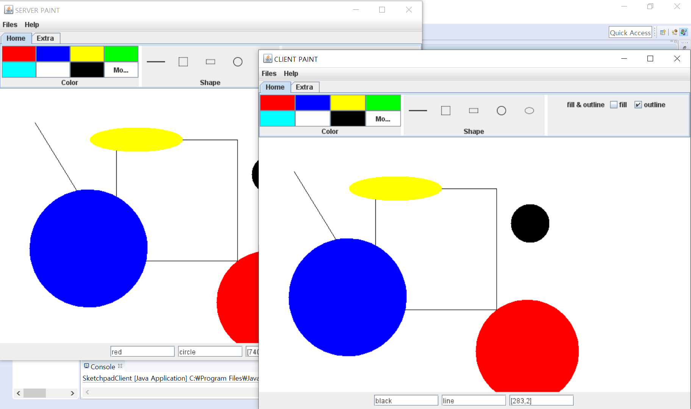
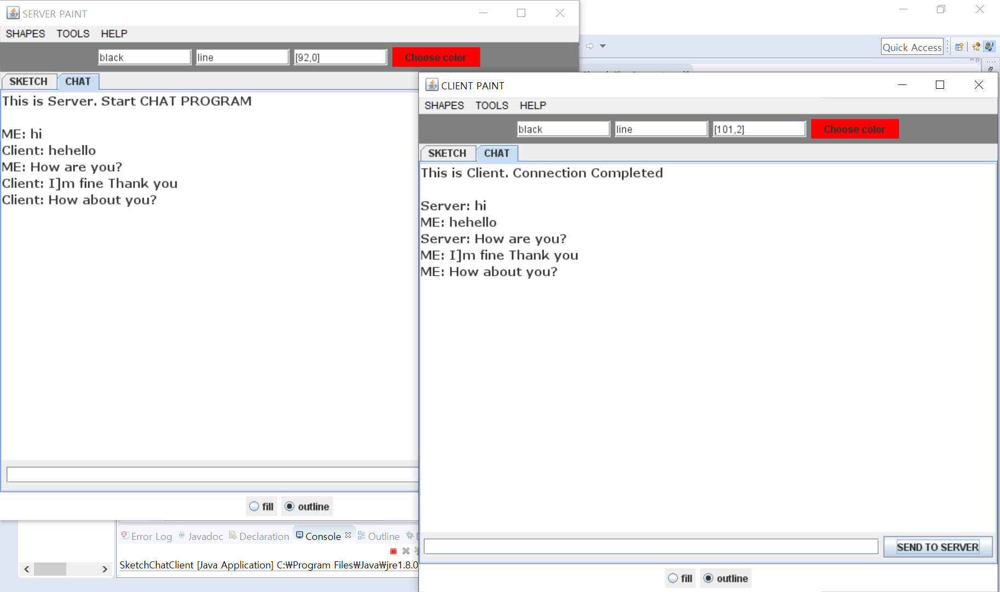

# PaintwithServer
Paint Board that can interact with Server realtime.(Final Project on JAVA Programming Class)
You have to install JDK, Java Eclipse

#### Details
I wanted to implement real-time paint in this project(Project A). It is implemented for servers and clients.I wanted to create a program to do that. So you can apply a file to save / read (printWriter or BufferedReader). In addition, the Paint implementation using ObjectOutputStream and ObjectInputStream to communicate with Object.

For more, I attached another project(Project A) that is avaliable to chat.

